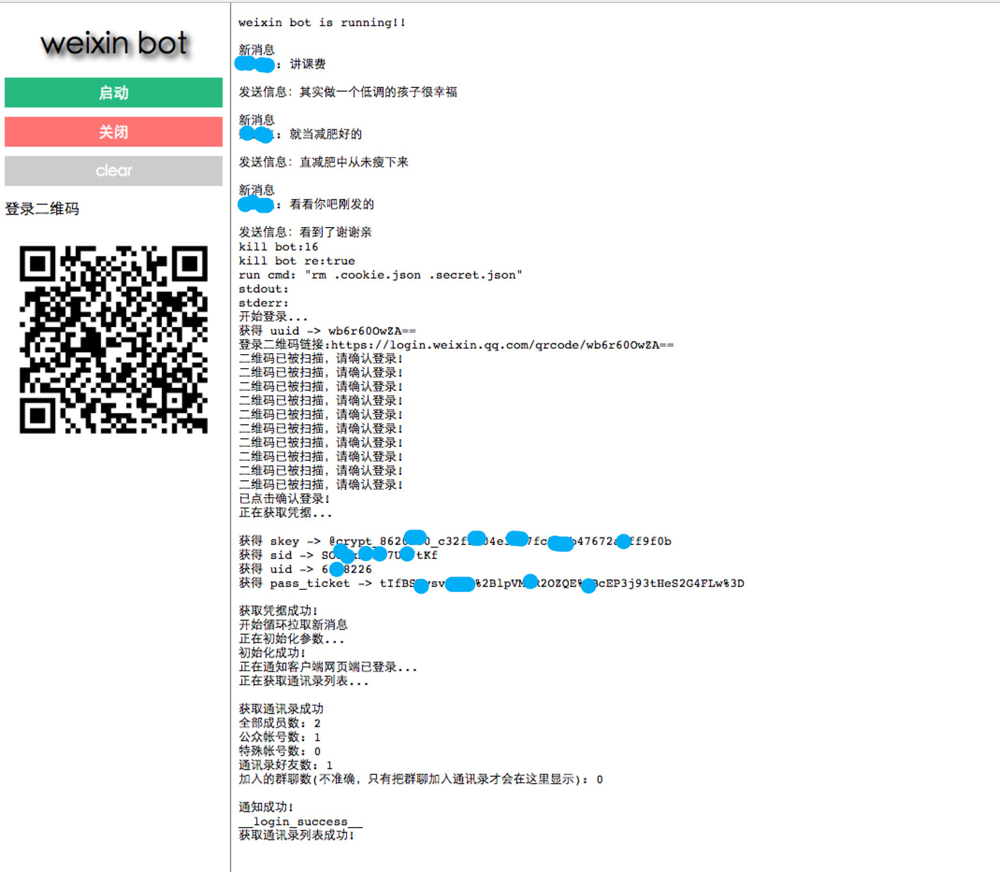

# weixin-bot
***
基于网页微信，和turing123机器人接口，网页登录微信账户，自动回答

## 功能
- 群消息被@，自动回答
- 个人消息，自动回答

## 说明

项目基于 https://github.com/feit/WeixinBot   和[turing123](http://www.tuling123.com/)的接口  

## 配置
config.js
```
{
  user:{
    name:'weivea', //管理账户
    pass:'weivea'
  },
  weixin:{
    nickName:'weivea' //微信昵称
  },
  turing:{//turing123接口配置
    APIUrl: 'http://www.tuling123.com/openapi/api',
    APIkey: '87e6994461dbb88ea3834de2195',
    secret: '677d6583',
  }
}
```

控制界面：


